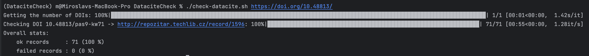

# Data Cite check tool

# Usage

In console, run the check datacite tool:

```bash
./check-datacite.sh 10.48813
```

or

```bash
./check-datacite.sh https://doi.org/10.48813
```

Feel free to pass multiple prefixes.

When running, the tool shows progress and estimated time:



# Output

The program will create a CSV with a name 
"datacite-check-output.csv" in the following form:

```csv
doi,title,url,registered,status,errors
https://doi.org/10.48813/a,"","",date,ok,
https://doi.org/10.48813/b,"","",date,error,err1,err2,err3
```

To change the name of the file, pass `--output=<filename>` to the tool.

